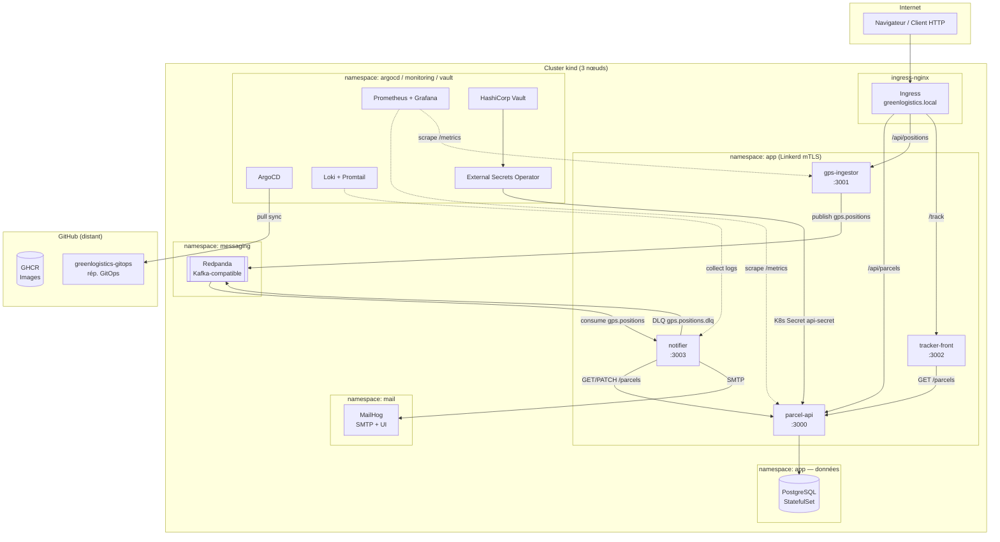

# Architecture GreenLogistics

## Diagramme global



## Flux de données principal

```
Client mobile
    │
    ▼ POST /api/positions/{parcelId}
gps-ingestor
    │ publish → gps.positions (Kafka/Redpanda)
    ▼
notifier (consumer group: notifier-group)
    │ GET /parcels/{id}  (parcel-api)
    │ haversine distance < 2000m ?
    │   └─ OUI → envoi email MailHog
    │            PATCH /parcels/{id}/status (OUT_FOR_DELIVERY → DELIVERING)
    │   distance < 100m ?
    │   └─ OUI → PATCH status → DELIVERED
    │
    └─ Erreur (3 retries) → DLQ gps.positions.dlq
```

## SLOs

| SLO | Cible | Alerte PrometheusRule |
|-----|-------|----------------------|
| Taux d'erreur HTTP | < 1% | `SLOErrorRateBreach` |
| Latence P95 | < 200ms | `SLOLatencyP95Breach` |

## Canary — Argo Rollouts

```
Déploiement parcel-api
  │
  ├── 20% canary  ──(2 min)──▶ 50% ──(2 min)──▶ 100%
  │                              │
  │                        AnalysisRun
  │                    (success rate ≥ 99%)
  └── abort si analyse KO
```
